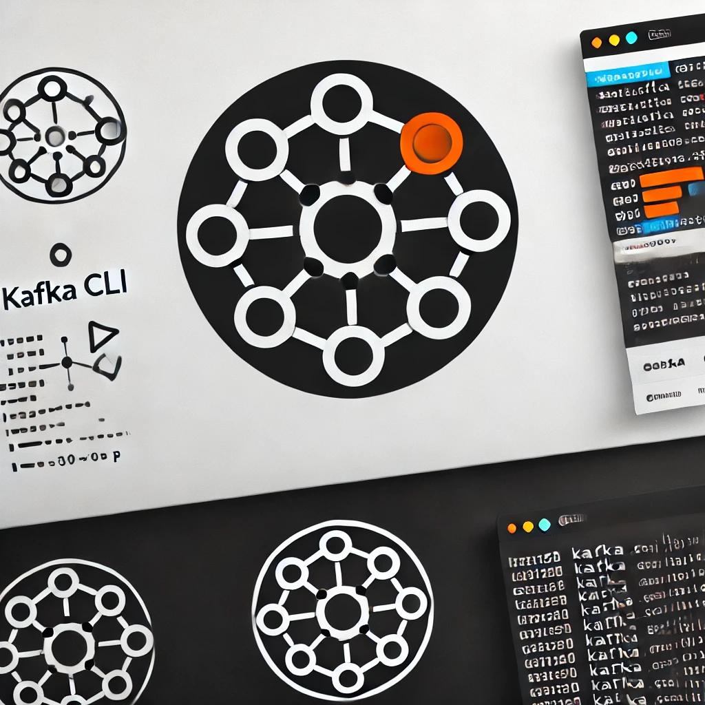

<p align="center">
  
</p>

[](https://search.maven.org/artifact/com.github.imrafaelmerino/kafka-cli/1.0.0/jar)

- [Introduction](#intro)
- [Configuration File](#conf)
- [List of Commands](#list)
- [Starting the CLI](#starting-the-cli)
- [Useful Examples](#examples)
- [Related Projects](#rp)

## <a name="intro"><a/> Introduction

Kafka CLI is a powerful command-line interface tool designed to simplify and enhance your
interaction with Apache Kafka. Kafka, a distributed streaming platform, is widely used for building
real-time data pipelines and streaming applications. However, managing Kafka producers and
consumers, as well as publishing messages, can be complex and time-consuming. Kafka CLI addresses
these challenges by providing an easy-to-use interface for performing common Kafka tasks.

### Why Use Kafka CLI?

- **Ease of Use**: Kafka CLI simplifies the process of starting, stopping, and listing Kafka
  producers and consumers. It abstracts the complexity of Kafka’s configurations and operations,
  allowing you to focus on your core tasks.

- **Flexibility**: The CLI supports multiple producers and consumers with different configurations,
  making it easy to experiment and tailor your Kafka setup to specific requirements. Whether you
  need different serializers, retry configurations, or specific topic subscriptions, Kafka CLI has
  you covered.

- **Experimentation**: Kafka CLI encourages experimentation by allowing you to quickly set up and
  test different configurations. This is particularly useful for development and testing
  environments where you need to iterate rapidly and understand how different settings affect your
  Kafka setup.

- **Customizable Data Generation**: With built-in support for customizable data generators, you can
  easily publish both generated and custom messages to Kafka topics. This feature is essential for
  simulating various scenarios and testing the robustness of your Kafka-based applications.

- **Session Logging**: Every command and its output can be automatically logged to a session file
  (if specified), providing an audit trail and making it easier to debug and review your operations.

- **Extensibility**: Since it's developed in Java, it is extremely easy to add custom and complex
  commands to Kafka CLI.

## <a name="conf"><a/> Configuration File

The configuration file provided is just an example to illustrate how the Kafka CLI works. You can
customize it to fit your needs by adding any number of consumers, channels, and producers, each with
their own configurations. This flexibility allows you to tailor the CLI tool to your specific Kafka
setup and requirements.

```json
{
  "conf": {
    "aliases": {
      "producer-start": "ps",
      "producer-list": "pls",
      "producer-stop": "pst",
      "producer-publish": "pb",
      "producer-publish-file": "pbf",
      "consumer-start": "cs",
      "consumer-list": "cls",
      "consumer-stop": "cst",
      "channel-list": "chls"
    },
    "welcome_message": "Welcome to kafka CLI! Go to https://github.com/imrafaelmerino/kafka-cli for further info",
    "session_file_dir": "PROJECT_HOME/logs",
    "colors": {
      "error": "\u001B[0;31m",
      "result": "\u001B[0;34m",
      "prompt": "\u001B[0;32m"
    }
  },
  "kafka": {
    "props": {
      "bootstrap.servers": "localhost:29092",
      "schema.registry.url": "http://localhost:8081"
    },
    "consumers": {
      "consumer1": {
        "topics": ["topic1"],
        "pollTimeoutSec": 10,
        "props": {
          "key.deserializer": "jsonvalues.spec.deserializers.confluent.ConfluentDeserializer",
          "value.deserializer": "jsonvalues.spec.deserializers.confluent.ConfluentDeserializer",
          "auto.offset.reset": "earliest",
          "enable.auto.commit": true,
          "group.id": "kafka.cli"
        }
      },
      "consumer2": {
        "topics": ["topic2"],
        "pollTimeoutSec": 10,
        "props": {
          "key.deserializer": "org.apache.kafka.common.serialization.StringDeserializer",
          "value.deserializer": "org.apache.kafka.common.serialization.StringDeserializer",
          "auto.offset.reset": "earliest",
          "enable.auto.commit": true,
          "group.id": "kafka.cli"
        }
      }
    },
    "producers": {
      "producer1": {
        "props": {
          "auto.register.schemas": "false",
          "key.serializer": "jsonvalues.spec.serializers.confluent.ConfluentSerializer",
          "value.serializer": "jsonvalues.spec.serializers.confluent.ConfluentSerializer",
          "acks": "all",
          "request.timeout.ms": 3000,
          "delivery.timeout.ms": 10000,
          "linger.ms": 2000
        }
      },
      "producer2": {
        "props": {
          "auto.register.schemas": "false",
          "key.serializer": "org.apache.kafka.common.serialization.StringSerializer",
          "value.serializer": "org.apache.kafka.common.serialization.StringSerializer",
          "acks": "all",
          "request.timeout.ms": 3000,
          "delivery.timeout.ms": 10000,
          "linger.ms": 2000
        }
      }
    }
  },
  "channels": {
    "channel1": {
      "producer": "producer1",
      "topic": "topic1",
      "key-generator": "keyGen",
      "value-generator": "valueGen",
      "key-schema": "{\"type\":\"record\",\"name\":\"key\",\"namespace\":\"com.example.key\",\"fields\":[{\"name\":\"_id\",\"type\":\"string\"}]}",
      "value-schema": "{\"type\":\"record\",\"name\":\"record\",\"namespace\":\"com.example.record\",\"fields\":[{\"name\":\"c\",\"type\":\"string\"},{\"name\":\"b\",\"type\":\"string\"},{\"name\":\"a\",\"type\":\"int\"}]}"
    },
    "channel2": {
      "producer": "producer2",
      "value-generator": "textGen",
      "topic": "topic2"
    }
  }
}
```

### `conf` Section

This section includes general configuration settings for the CLI tool. All the fields in the `conf`
section are optional.

- **aliases**: Defines shortcuts for commands. For example, instead of typing `producer-start`, you
  can use the alias `ps`.

- **welcome_message**: The message displayed when the CLI is started.

- **session_file_dir**: Directory where session files are stored. Each time the CLI is started, a
  new session file is created and all the commands typed by the user and their outputs will be
  dumped into that file.

- **colors**: Defines color codes for different types of messages using ANSI escape codes. These
  codes are used to control the formatting, color, and other output options on text terminals.

  - **Error Messages**: `\u001B[0;31m` - Sets the text color to red.
  - **Result Messages**: `\u001B[0;34m` - Sets the text color to blue.
  - **Prompt Messages**: `\u001B[0;32m` - Sets the text color to green.

  These codes are prefixed with `\u001B` (which represents the escape character) followed by `[`,
  and then the color code (e.g., `0;31m` for red). Here’s a breakdown of the codes:

  - `0` indicates the default text style.
  - `31` sets the text color to red.
  - `34` sets the text color to blue.
  - `32` sets the text color to green.

### `kafka` Section

This section is mandatory and includes configuration settings related to Kafka. It is recommended to
use just one producer, as this is the most efficient way of publishing to Kafka. Only create
different producers when you need different configurations (e.g., different serializers or retry
configurations).

#### General Kafka Properties

The common Kafka properties specified under `props` will be added to all the consumers and
producers, providing a convenient way to avoid repeating the same properties multiple times in the
configuration file. For example, you always have to specify the servers. You may need some
additional general properties for secure communication and authentication between Kafka clients,
brokers, and the schema registry. Find an example in this [configuration
file](kafka-cli-template/conf1.json)

#### Consumers

Configuration for Kafka consumers.

- `topics`: List of topics the consumer subscribes to.
- `pollTimeoutSec`: Poll timeout in seconds.
- `props`: Properties specific to each consumer, such as deserializers, offset reset policy, and
  group ID. When using Avro to serialize data, you must use the deserializers from
  [avro-spec](https://github.com/imrafaelmerino/avro-spec), as shown in `consumer1`:
  ```json
  "key.deserializer": "jsonvalues.spec.deserializers.confluent.ConfluentDeserializer",
  "value.deserializer": "jsonvalues.spec.deserializers.confluent.ConfluentDeserializer"
  ```

#### Producers

Configuration for Kafka producers.

- `props`: Properties specific to each producer, such as serializers, acknowledgments, timeouts, and
  linger settings. When using Avro to serialize data, you must use the serializers from
  [avro-spec](https://github.com/imrafaelmerino/avro-spec), as shown in `producer1`:
  ```json
  "key.serializer": "jsonvalues.spec.serializers.confluent.ConfluentSerializer",
  "value.serializer": "jsonvalues.spec.serializers.confluent.ConfluentSerializer"
  ```

#### `channels` Section

This section defines channels, which are logical groupings that link producers to topics and define
schemas and generators for keys and values. Generators specified in the channels are necessary to

use the `producer-publish` command, which uses them to generate the data.

- **producer**: The name of the producer associated with this channel.
- **topic**: The Kafka topic this channel publishes to.
- **key-generator**: The generator used for the keys. This field needs to be specified if you want
  to use the `producer-publish` command, as the command uses the generator to produce the data.
- **value-generator**: The generator used for the values. This field needs to be specified if you
  want to use the `producer-publish` command, as the command uses the generator to produce the data.
- **key-schema**: The Avro schema for the keys.
- **value-schema**: The Avro schema for the values.

### Summary

This configuration file allows you to set up and manage your Kafka CLI tool effectively by defining
shortcuts, message formats, Kafka properties, consumer and producer settings, and channels linking
producers to topics with appropriate schemas and generators. Remember, it's best to use a single
producer for efficiency unless different configurations are necessary. For Avro data, use the
serializers and deserializers from [avro-spec](https://github.com/imrafaelmerino/avro-spec),
otherwise you'll get an error.

---

## <a name="list"><a/> List of Commands

### Producer Commands

- **producer-list** (alias: pls)

  - Usage: `producer-list`
  - Description: Lists all Kafka producers along with their statuses (up or down).
  - Output: The list of producers with their names and statuses.

- **producer-start** (alias: ps)
  - Usage: `producer-start [producer-name]`
  - Description: Starts a Kafka producer using the provided configuration.
  - Parameters:
    - `producer-name` (optional): The name of the producer to start. If not provided, the user will
      be prompted to select from a list of available

producers.

- Output:

  - Success: "Producer `<producer-name>` started!"
  - Failure: Appropriate error message if the configuration is not found or if the producer is
    already started.

- **producer-stop** (alias: pst)

  - Usage: `producer-stop [producer-name]`
  - Description: Stops a running Kafka producer.
  - Parameters:
    - `producer-name` (optional): The name of the producer to stop. If not provided, the user will
      be prompted to select from a list of available producers.
  - Output:
    - Success: "Producer `<producer-name>` closed!"
    - Failure: Appropriate error message if the producer is not found or is already closed.

- **producer-publish** (alias: pb)

  - Usage: `producer-publish [channel-name]`
  - Description: Sends a generated key-value pair or value to a specified Kafka topic using the
    appropriate Kafka producer.
  - Parameters:
    - `channel-name` (optional): The name of the channel to publish to. If not provided, the user
      will be prompted to select from a list of available channels with an `up` status.
  - Output:
    - Success: A message indicating that the record was successfully sent, along with the offset and
      partition details.
    - Failure: Appropriate error message if the producer is not started or if the channel name is
      invalid.

- **producer-publish-file** (alias: pbf)
  - Usage: `producer-publish-file {channel} {file_path}`
  - Description: Publishes records from a file to the specified Kafka channel. This command allows
    you to generate custom data (not generated by the CLI) and specify the format of the file.
  - Parameters:
    - `channel`: The name of the Kafka channel to publish to.
    - `file_path`: The absolute path of the file containing records to publish.
  - File Format:
    - Each record should be separated by a new line.
    - Each record consists of one or more lines, starting with either "headers:", "key:", or
      "value:".
    - Headers and key are optional.
    - Headers must be a JSON object.
  - Example:
    ```plaintext
    headers: {"header1": "value1", "header2": "value2"}
    key: {"_id": "key1"}
    value: {"a": 1, "b": "text", "c": "more text"}
    ```
  - Output:
    - Success: Messages indicating that the records were successfully sent, along with the offset
      and partition details.
    - Failure: Appropriate error message if the producer is not started or if the channel name is
      invalid.

### Consumer Commands

- **consumer-list** (alias: cls)

  - Usage: `consumer-list`
  - Description: Lists all Kafka consumers along with their statuses (up or down).
  - Output: The list of consumers with their names and statuses.

- **consumer-start** (alias: cs)

  - Usage: `consumer-start [consumer-name] [-verbose]`
  - Description: Starts a Kafka consumer using the provided configuration.
  - Parameters:
    - `consumer-name` (optional): The name of the consumer to start. If not provided, the user will
      be prompted to select from a list of available consumers.
    - `-verbose` (optional): If provided, the consumer will output a verbose log of the received
      messages.
  - Output:
    - Success: "Consumer `<consumer-name>` started!"
    - Failure: Appropriate error message if the configuration is not found or if the consumer is
      already started.

- **consumer-stop** (alias: cst)

  - Usage: `consumer-stop [consumer-name]`
  - Description: Stops a running Kafka consumer.
  - Parameters:
    - `consumer-name` (optional): The name of the consumer to stop. If not provided, the user will
      be prompted to select from a list of available consumers.
  - Output:
    - Success: "Consumer `<consumer-name>` closed!"
    - Failure: Appropriate error message if the consumer is not found or is already closed.

- **consumer-commit**
  - Usage: `consumer-commit [consumer-name]`
  - Description: Sends an asynchronous commit request to the specified consumer.
  - Parameters:
    - `consumer-name`: The name of the consumer to commit.
  - Output:
    - Success: "Commit request sent to consumer `<consumer-name>`!"

### Channel Commands

- **channel-list** (alias: chls)
  - Usage: `channel-list`
  - Description: Prints out the list of channels defined in the configuration file.
  - Output: The list of channels with their names, associated producers, statuses, and topics.

## Examples of Commands and Outputs

```shell
Welcome to kafka CLI! Go to https://github.com/imrafaelmerino/kafka-cli for further info
~ list

base64-decode
base64-encode
channel-list              (chls)
clear
consumer-commit
consumer-list             (cls)
consumer-start            (cs)
consumer-stop             (cst)
echo
exit
file-dump
file-read
gen topic1KeyGen
gen topic1ValueGen
gen topic2ValueGen
gen topic3ValueGen
help
history
json-get
json-pairs
json-pretty
last
list
print-conf
producer-list             (pls)
producer-publish          (pb)
producer-publish-file     (pbf)
producer-start            (ps)
producer-stop             (pst)
script
url-encode
var-clear
var-get
var-set

~ ps

producer1
producer2

Type the producer name (One of the above):
~ producer1

Producer `producer1` started!

~ ps

producer1
producer2

Type the producer name (One of the above):
~ producer2

Producer `producer2` started!

~ channel-list

Name                 Producer             Status               Topic
--------------------------------------------------------------------------------
1                    producer1            up                   topic1
2                    producer2            up                   topic2

~ pb

Name                 Producer             Status               Topic
--------------------------------------------------------------------------------
1                    producer1            up                   topic1
2                    producer2            up                   topic2

Type the channel name (choose one of the above with an `up` Status):
~ 2

Publish request sent:
  Topic: topic2
  Value: WFrPIbmzpmiUVQNffJOnnYyiJNscwuMwYgQnwvrfbnMTWxmuzuXkvCbRtszRQDIoxkjihSqrYpmPBaQbxZlUIuvKhdEUqQsR


Publish response received:
  Topic: topic2
  Offset: 0
  Partition: 0
  Timestamp: 2024-05-23T20:46:39.330Z

~ producer-publish 2

Publish request sent:
  Topic: topic2
  Value: QpnFqfLaKdoqLgLGEhCNCFGYTPyxjuZRGRCrdllrHqJfNFWXmmZjbeLoQBgYZTjJsQwlUOibunwnQomqMpTSrRqzXyU


Publish response received:
  Topic: topic2
  Offset: 1
  Partition: 0
  Timestamp: 2024-05-23T20:47:43.454Z

~ last 3

Publish request sent:
  Topic: topic2
  Value: QpnFqfLaKdoqLgLGEhCNCFGYTPyxjuZRGRCrdllrHqJfNFWXmmZjbeLoQBgYZTjJsQwlUOibunwnQomqMpTSrRqzXyU


Publish request sent:
  Topic: topic2
  Value: QpnFqfLaKdoqLgLGEhCNCFGYTPyxjuZRGRCrdllrHqJfNFWXmmZjbeLoQBgYZTjJsQwlUOibunwnQomqMpTSrRqzXyU


Publish request sent:
  Topic: topic2
  Value: QpnFqfLaKdoqLgLGEhCNCFGYTPyxjuZRGRCrdllrHqJfNFWXmmZjbeLoQBgYZTjJsQwlUOibunwnQomqMpTSrRqzXyU


Publish response received:
  Topic: topic2
  Offset: 2
  Partition: 0
  Timestamp: 2024-05-23T20:47:49.080Z

Publish response received:
  Topic: topic2
  Offset: 3
  Partition: 0
  Timestamp: 2024-05-23T20:47:51.097Z

Publish response received:
  Topic: topic2
  Offset: 4
  Partition: 0
  Timestamp: 2024-05-23T20:47:53.110Z

~ consumer-list

Name                 Status     Topics
consumer2            down       topic3
consumer1            up         topic1,topic2

~ consumer-start

consumer2
consumer1

Type the consumer name (choose one of the above):
~ consumer2


Do you want a verbose output of the received messages? (yes | no)
~ yes

Consumer `consumer2` started!

~
Received 5 records from topics `[topic2]` in consumer `consumer2`

Record 1:
  Offset: 0
  Key: null
  Value: WFrPIbmzpmiUVQNffJOnnYyiJNscwuMwYgQnwvrfbnMTWxmuzuXkvCbRtszRQDIoxkjihSqrYpmPBaQbxZlUIuvKhdEUqQsR
  Partition: 0
  Timestamp: 1716497199330

Record 2:
  Offset: 1
  Key: null
  Value: QpnFqfLaKdoqLgLGEhCNCFGYTPyxjuZRGRCrdllrHqJfNFWXmmZjbeLoQBgYZTjJsQwlUOibunwnQomqMpTSrRqzXyU
  Partition: 0
  Timestamp: 1716497263454

Record 3:
  Offset: 2
  Key: null
  Value: QpnFqfLaKdoqLgLGEhCNCFGYTPyxjuZRGRCrdllrHqJfNFWXmmZjbeLoQBgYZTjJsQwlUOibunwnQomqMpTSrRqzXyU
  Partition: 0
  Timestamp: 1716497269080

Record 4:
  Offset: 3
  Key: null
  Value: QpnFqfLaKdoqLgLGEhCNCFGYTPyxjuZRGRCrdllrHqJfNFWXmmZjbeLoQBgYZTjJsQwlUOibunwnQomqMpTSrRqzXyU
  Partition: 0
  Timestamp: 1716497271097

Record 5:
  Offset: 4
  Key: null
  Value: QpnFqfLaKdoqLgLGEhCNCFGYTPyxjuZRGRCrdllrHqJfNFWXmmZjbeLoQBgYZTjJsQwlUOibunwnQomqMpTSrRqzXyU
  Partition: 0
  Timestamp: 1716497273110


~ producer-stop

producer1
producer2

Type the producer name (One of the above):
~ producer2

Producer `producer2` closed!

~ exit
bye bye!
```

---

## <a name="starting-the-cli"><a/> Starting the CLI

To start the CLI, you can use the provided Maven project [`kafka-cli-template`](kafka-cli-template).

### Step 1: Edit the `pom.xml` File

Edit the [`pom.xml`](kafka-cli-template/pom.xml) file to specify the main class you have to create.
For example:

```xml

<mainClass>com.example.cli.MyCLI</mainClass>

```

### Step 2: Create the Main Class

Create a main class, such as `MyCLI`, that initializes the Kafka CLI with the necessary generators.
Below is an example of what this class might look like:

```java
package com.example.cli;

import com.github.imrafaelmerino.kafkacli.KafkaCLI;
import fun.gen.Gen;
import fun.gen.StrGen;
import java.util.HashMap;
import java.util.Map;
import java.util.function.Supplier;
import jsonvalues.JsObj;
import jsonvalues.gen.JsDoubleGen;
import jsonvalues.gen.JsIntGen;
import jsonvalues.gen.JsObjGen;
import jsonvalues.gen.JsStrGen;

public class MyCLI {

  public static void main(String[] args) {

    Map<String, Gen<?>> generators = new HashMap<>();

    generators.put("topic1KeyGen",
                   JsObjGen.of("_id",
                               JsStrGen.alphabetic()));

    generators.put("topic1ValueGen",
                   JsObjGen.of("a",
                               JsIntGen.arbitrary(0,
                                                  1000),
                               "b",
                               JsStrGen.alphabetic(),
                               "c",
                               JsStrGen.alphabetic()
                              )
                  );

    generators.put("topic2ValueGen",
                   JsObjGen.of("id",
                               JsStrGen.alphabetic(),
                               "amount",
                               JsDoubleGen.arbitrary(100.0d,
                                                     1000d)
                              ));

    generators.put("topic3ValueGen",
                   StrGen.alphabetic(10,
                                     100));

    new KafkaCLI(generators).start(args);


  }
}

```

As you can see, the generators specified in the configuration file (`topic1KeyGen`,
`topic1ValueGen`, `topic2ValueGen` and `topic3ValueGen`) must be created and used to instantiate the
`KafkaCLI` object.

### Step 3: Execute the Maven Command

To start the CLI, execute the following Maven command:

```sh
sdk install java 21-open

sdk use java 21-open

mvn exec:java
```

### Notes

You can edit the [`pom.xml`](kafka-cli-template/pom.xml) file to change the path of the
configuration file and the log4j file where the Kafka client dumps its log entries. For example:

```xml

<arguments>
    <argument>${project.basedir}/conf.json</argument>
</arguments>

<systemProperties>
    <systemProperty>
        <key>log4jFilePath</key>
        <value>${project.basedir}/logs/cli.log</value>
    </systemProperty>
</systemProperties>
```

This configuration specifies that the CLI will use `conf.json` for its configuration and `cli.log`
for logging.

---

### Step 4: Set up a Kafka broker and a Schema Registry!

Before publishing or consuming any message, ensure that Kafka is up and running, a topic is created,
and an Avro schema is associated with the topic's values. To do this, follow the steps below, using
the provided [`docker-compose.yml`](src/test/resources/docker-compose.yml) file to start the
Confluent platform:

```shell

cd kafka-cli-template

docker-compose up

SCHEMA_REGISTRY_HOST="localhost"
SCHEMA_REGISTRY_PORT="8081"
REST_PROXY_PORT="8082"
REST_PROXY_HOST="localhost"
TOPIC_TX_NAME="topic2"
TOPIC1_NAME="topic1"
TOPIC2_NAME="topic2"
TOPIC3_NAME="topic3"

CLUSTER_ID=$(curl -s -X GET -H "Accept: application/json" "http://${REST_PROXY_HOST}:${REST_PROXY_PORT}/v3/clusters" | jq -r '.data[0].cluster_id')

echo $CLUSTER_ID

# Define topic names
TOPICS=("${TOPIC1_NAME}" "${TOPIC2_NAME}" "${TOPIC3_NAME}")

# Loop through the topics and create each one
for TOPIC_NAME in "${TOPICS[@]}"; do
  curl -X POST \
    -H "Content-Type: application/json" \
    -H "Accept: application/json" \
    --data '{
      "topic_name": "'"${TOPIC_NAME}"'",
      "partitions_count": 1,
      "replication_factor": 1
    }' \
    "http://${REST_PROXY_HOST}:${REST_PROXY_PORT}/v3/clusters/${CLUSTER_ID}/topics"
done

curl -X POST \
-H "Content-Type: application/vnd.schemaregistry.v1+json" \
--data @payloads/payment-schema.json \
"http://${SCHEMA_REGISTRY_HOST}:${SCHEMA_REGISTRY_PORT}/subjects/${TOPIC2_NAME}-value/versions"

curl -X POST \
-H "Content-Type: application/vnd.schemaregistry.v1+json" \
--data @payloads/record-schema.json \
"http://${SCHEMA_REGISTRY_HOST}:${SCHEMA_REGISTRY_PORT}/subjects/${TOPIC1_NAME}-value/versions"

curl -X POST \
-H "Content-Type: application/vnd.schemaregistry.v1+json" \
--data @payloads/key-schema.json \
"http://${SCHEMA_REGISTRY_HOST}:${SCHEMA_REGISTRY_PORT}/subjects/${TOPIC1_NAME}-key/versions"


```

You can verify that everything is working correctly by visiting the Control Center at
[http://localhost:9021/clusters](http://localhost:9021/clusters).

### Step 5: Playing around Kafka-CLI typing some commands!

Let's see the available commands that start with consumer and producer and if any alias has been
defined in the conf file

```shell
~ list consumer

consumer-commit
consumer-list             (cl)
consumer-start            (cs)
consumer-stop             (cst)

~ list producer

producer-list             (pl)
producer-publish          (pb)
producer-publish-file     (pbf)
producer-start            (ps)
producer-stop             (pst)

```

Let's start all the producers and publish some messages:

```shell
~ pl

Name                 Status
producer1            down
producer2            down

~ ps producer1

Producer `producer1` started!

~ ps producer2

Producer `producer2` started!

~ pb

Name                 Producer             Status               Topic
--------------------------------------------------------------------------------
1                    producer1            up                   topic1
2                    producer2            up                   topic3
3                    producer1            up                   topic2

Type the channel name (choose one of the above with an `up` Status):
~ 1

Publish request sent:
  Topic: topic1
  Key: {"_id": "u"}
  Value: {"c": "u", "b": "y", "a": 884}


Publish response received:
  Topic: topic1
  Offset: 2
  Partition: 0
  Timestamp: 2024-11-22T08:21:20.163Z

~  pb 2

Publish request sent:
  Topic: topic3
  Value: QXaUypUtwvBI


Publish response received:
  Topic: topic3
  Offset: 1
  Partition: 0
  Timestamp: 2024-11-22T08:22:07.161Z

~  pb 3

Publish request sent:
  Topic: topic2
  Value: {"id": "m", "amount": 585.6324318812799}


Publish response received:
  Topic: topic2
  Offset: 1
  Partition: 0
  Timestamp: 2024-11-22T08:22:22.994Z


```

Now let's start the consumers!

```shell
~ cl

Name                 Status     Topics
consumer2            down       topic3
consumer1            down       topic1,topic2

~ cs consumer1

Consumer `consumer1` started!

~
Received 2 records from topics `[topic1, topic2]` in consumer `consumer1`

~ cs consumer2 -verbose

Consumer `consumer2` started!

~
Received 1 records from topics `[topic3]` in consumer `consumer2`

Record 1:
  Offset: 1
  Key: null
  Value: QXaUypUtwvBI
  Partition: 0
  Timestamp: 1732263727161

~ exit
bye bye!

```

## <a name="examples"><a/> Useful Examples

Here's a useful script example that demonstrates how to automate a series of Kafka CLI commands
using a script file.

### Script File Example

Create a script file named `my_publisher.jio` with the following contents:

```plaintext
producer-start producer2
producer-publish 2
last every 100 for 10000
producer-stop producer2
```

This script will:

1. Start the producer named `producer2`.
2. Publish a generated message using the channel named `2`.
3. Repeat the last command (which is `producer-publish 2`) every 100 milliseconds for a total
   duration of 10000 ms (10 seconds).
4. Stop the producer named `producer2`.

### Running the Script

To run the script, use the following command in kafka-cli:

```sh
~ script ${DIR_PATH}/my_publisher.jio
```

This will execute all the commands in `my_publisher.jio` sequentially, automating the process and
saving you time.

---

This example demonstrates how you can leverage the Kafka CLI to automate common tasks, making it a
powerful tool for managing your Kafka setup efficiently.

## <a name="rp"><a/> Related Projects

- [avro-spec](https://github.com/imrafaelmerino/avro-spec)
- [jio-cli](https://github.com/imrafaelmerino/jio?tab=readme-ov-file#jio-cli)
- [json-values](https://github.com/imrafaelmerino/json-values)
